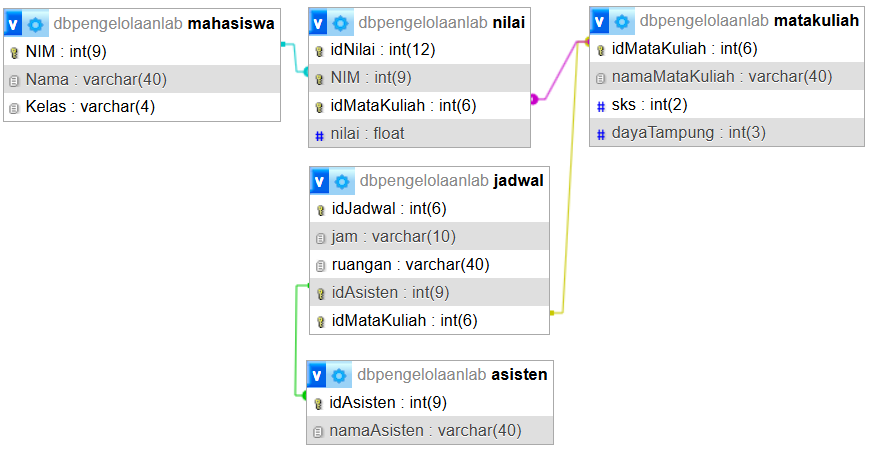

# Database Pengelolaan Laboratorium Praktikum Informatika

## Deskripsi Project

Project ini merupakan perancangan database relational untuk membantu pengelolaan kegiatan praktikum Laboratorium Informatika.

Database ini dibuat untuk mengatasi permasalahan pengelolaan data praktikum yang sebelumnya masih tersebar, seperti data mahasiswa, mata kuliah, asisten praktikum, jadwal, serta nilai praktikum.

Fokus utama project ini adalah menerapkan konsep:
- Entity Relationship Diagram (ERD)
- Primary Key dan Foreign Key
- Relasi One-to-One, One-to-Many, dan Many-to-Many
- Implementasi database menggunakan MySQL

## Studi Kasus

Sebagai stakeholder, Laboratorium Informatika membutuhkan sistem database yang dapat menyimpan dan mengelola informasi kegiatan praktikum.

Permasalahan yang terjadi:
- Data mahasiswa dan praktikum sulit dikelola karena belum terintegrasi
- Pencatatan nilai masih dilakukan secara terpisah
- Sulit mengetahui hubungan antara mahasiswa, mata kuliah, asisten, dan jadwal praktikum
- Rekap data praktikum membutuhkan waktu lebih lama

## Tujuan Database

Database ini bertujuan untuk:
- Menyimpan data mahasiswa
- Menyimpan data mata kuliah praktikum
- Mengelola data asisten praktikum
- Menyimpan jadwal praktikum
- Mencatat nilai mahasiswa pada mata kuliah yang diambil

# Entity Database

## 1. Mahasiswa

Menyimpan informasi mahasiswa.

Atribut:
- NIM (Primary Key)
- Nama
- Kelas

## 2. Mata Kuliah

Menyimpan informasi mata kuliah praktikum.

Atribut:
- idMataKuliah (Primary Key)
- namaMataKuliah
- SKS
- dayaTampung

## 3. Asisten

Menyimpan data asisten praktikum.

Atribut:
- idAsisten (Primary Key)
- namaAsisten

## 4. Jadwal

Menyimpan informasi jadwal pelaksanaan praktikum.

Atribut:
- idJadwal (Primary Key)
- jam
- ruangan
- idAsisten (Foreign Key)
- idMataKuliah (Foreign Key)

## 5. Nilai

Menyimpan hubungan mahasiswa dengan mata kuliah sekaligus nilai yang diperoleh.

Atribut:
- idNilai (Primary Key)
- NIM (Foreign Key)
- idMataKuliah (Foreign Key)
- nilai

# Relasi Database

## Mahasiswa - Nilai

Relasi:
One-to-Many (1:M)

Penjelasan:
Satu mahasiswa dapat memiliki banyak data nilai dari beberapa mata kuliah.

## Mata Kuliah - Nilai

Relasi:
One-to-Many (1:M)

Penjelasan:
Satu mata kuliah dapat memiliki banyak mahasiswa yang mendapatkan nilai.

## Mahasiswa - Mata Kuliah

Relasi:
Many-to-Many (M:N)

Implementasi:
Relasi dibuat melalui tabel Nilai.

Penjelasan:
Satu mahasiswa dapat mengambil banyak mata kuliah, dan satu mata kuliah dapat diambil oleh banyak mahasiswa.

## Mata Kuliah - Jadwal

Relasi:
One-to-Many (1:M)

Penjelasan:
Satu mata kuliah dapat memiliki beberapa jadwal praktikum.

## Asisten - Jadwal

Relasi:
One-to-Many (1:M)

Penjelasan:
Satu asisten dapat menangani beberapa jadwal praktikum.

# ERD

# Teknologi

- MySQL
- phpMyAdmin

## Author

Hendri Prasetyo  
Mahasiswa Informatika’24 